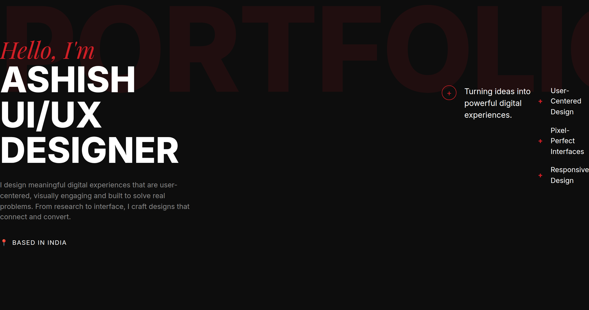
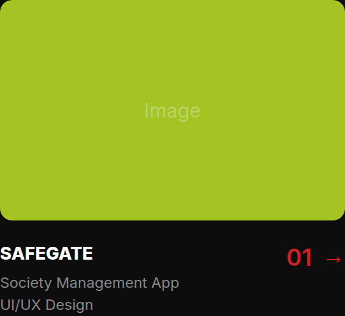
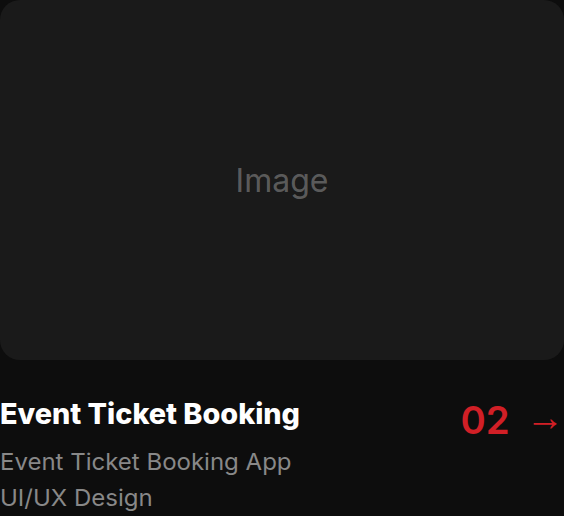
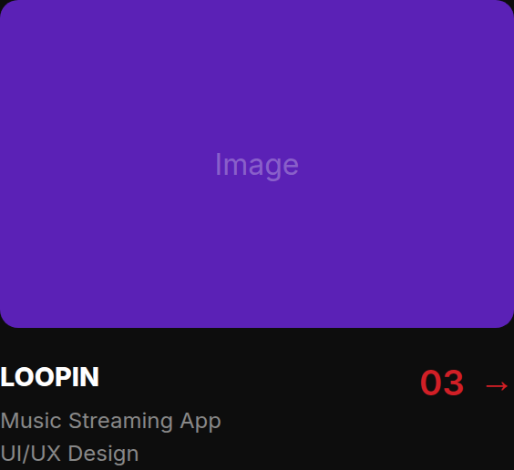
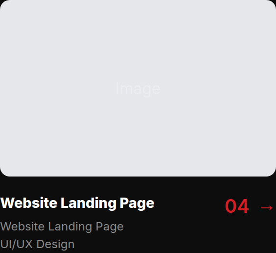
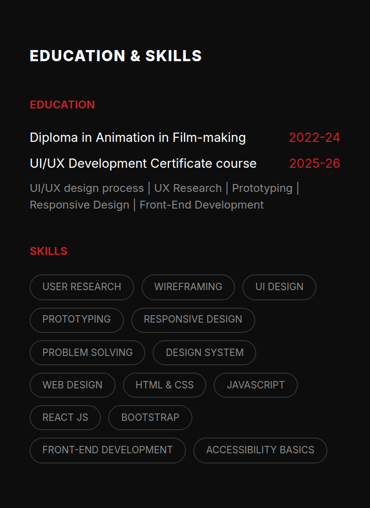
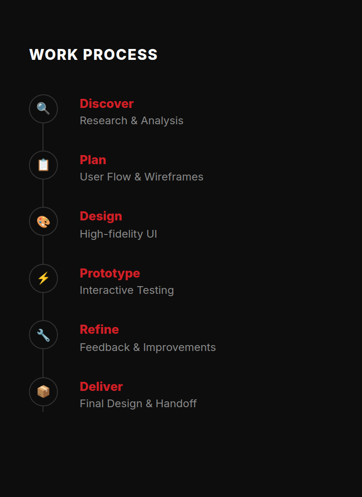
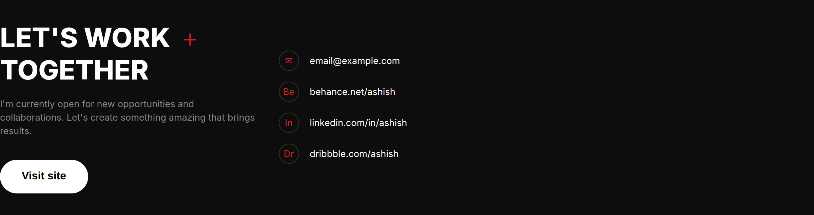

  <!-- Hero Section -->
  
  
    

  <!-- Projects Section Header -->
  <h2 align="left" style="letter-spacing: 2px;">SELECTED PROJECTS</h2>
  
  <!-- Project Cards Grid (2x2) -->
  
  &nbsp;
  
  
    

  
  &nbsp;
  

    

  <!-- Skills and Process Infographics (Side by Side) -->
  
  &nbsp;
  

    

  <!-- Let's Work Together / Footer Banner -->
  
  

